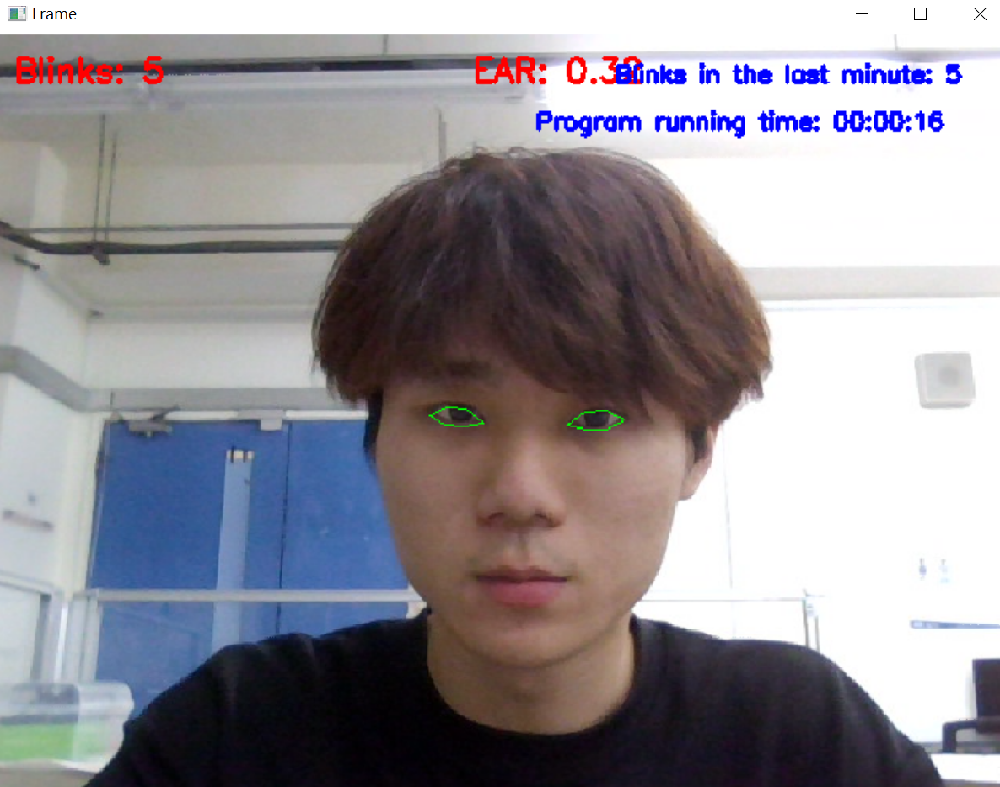
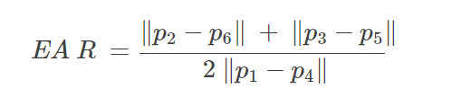
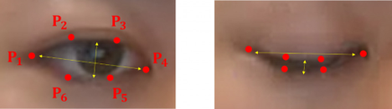
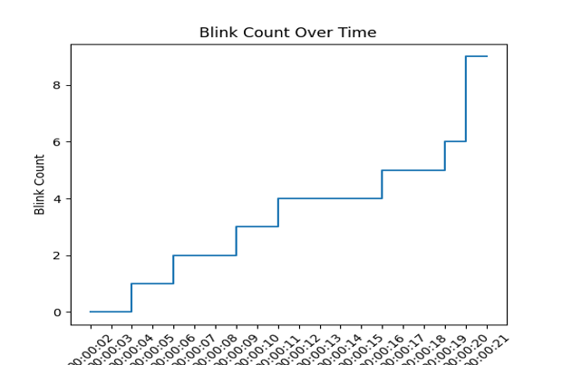
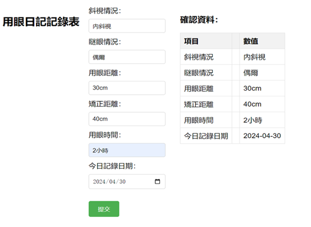

# Intelligent Eye Care (智慧 EYE 護)

An archived research prototype for monitoring blink frequency and screen-related eye-care habits. The project combines a Dlib/OpenCV blink monitor, an eye-care diary web prototype, presentation materials, a report, sample measurements, and a recorded demonstration.

## Try the browser demo

[Open the live Intelligent Eye Care demo](https://s960137.github.io/intelligent-eye-care/)

The demo is a static GitHub Pages site. It asks for a short anonymous eye-use questionnaire before requesting camera permission, calibrates an open-eye EAR threshold, and then displays the live EAR, blink count, estimated blinks per minute, and a cumulative chart.

- Camera frames are processed in the browser and are not recorded or uploaded by this project.
- Questionnaire answers remain in page memory only and disappear when the page is closed or refreshed.
- The page downloads the MediaPipe Tasks Vision library from jsDelivr and Google's Face Landmarker model at runtime.
- Results vary with lighting, camera angle, glasses reflections, and device performance. This is a research demonstration, not a medical device.

To run it locally, serve the directory instead of opening the HTML file directly:

```bash
python -m http.server 8000 --directory demo
```

Then open <http://localhost:8000>.


> # 這是研究與展示的醫工日專案，尚未串接資料庫，問卷與表單為展示用
> ! 不能取代診斷與治療



## What it does

- Detects a face and 68 facial landmarks with Dlib.
- Uses six landmarks around each eye to calculate the Eye Aspect Ratio (EAR).
- Counts one blink after the eyes reopen following a configurable number of closed-eye frames.
- Reports the running blink count and the number of blinks in the most recent minute.
- Optionally saves a blink-count chart when the program exits.
- Includes a no-database browser demo with an anonymous questionnaire, personal EAR calibration, live blink count, and session summary.
- Provides a Node.js / Express prototype for local user registration and eye-care diary entries.




## Project showcase / 專案展示

### 1. EAR threshold detection / 閾值判斷



Six landmarks around the eye are used to calculate the Eye Aspect Ratio (EAR). Comparing the EAR with a configured threshold distinguishes an open eye from a closed-eye frame and provides the basis for blink counting.

### 2. Blink record chart / 眨眼紀錄圖表



The step chart records the cumulative number of detected blinks over time. Each upward step represents a completed blink after the eye reopens.

### 3. Eye-use diary / 用眼日記表



The diary prototype records eye condition, blink status, viewing and correction distances, screen-use duration, and the record date, then presents the submitted values for confirmation.

### 4. Eye-care questionnaire / 眼睛照護表單


The questionnaire organizes basic information, eye-health history, current vision, daily device and lighting habits, and clinical follow-up notes. It demonstrates the broader eye-care record workflow paired with blink monitoring.

## Repository layout

```text
.
├── archive/original/       # Original 2024 prototype scripts
├── data/                   # Sample head-angle measurements
├── demo/                   # Static questionnaire and webcam blink demo
├── docs/                   # Presentation, report, video, and images
├── references/             # Research references
├── src/                    # Cleaned and testable blink monitor
├── tests/                  # Unit tests for metrics and blink state
└── web/                    # Express eye-care diary prototype
```

The [presentation](docs/intelligent-eye-care-presentation.pptx), [project report](docs/intelligent-eye-care-report.pdf), and [demo video](docs/blink-detection-demo.mp4) preserve the published project results. The original scripts are retained under `archive/original`; the runnable version under `src` fixes counting and path-handling issues while preserving the EAR-based approach.

## Set up the blink monitor

The cleaned implementation targets Python 3.11.

```bash
python -m venv .venv
```

Activate the environment, then install the dependencies:

```bash
python -m pip install -r requirements.txt
```

Download and decompress Dlib's official landmark model:

<http://dlib.net/files/shape_predictor_68_face_landmarks.dat.bz2>

The model is intentionally not committed because it is about 95 MiB. Dlib notes that it was trained on the iBUG 300-W dataset, whose license excludes commercial use. Review the upstream terms before using it outside research or education.

## Run the blink monitor

```bash
python src/blink_monitor.py --shape-predictor shape_predictor_68_face_landmarks.dat --plot-output blink-count.png
```

Press `q` to stop. Useful options include `--camera-index`, `--ear-threshold`, and `--consecutive-frames`.

To display all 68 facial landmarks without blink counting:

```bash
python src/face_landmarks_demo.py --shape-predictor shape_predictor_68_face_landmarks.dat
```

## Run the web prototype

Requirements: Node.js 18 or later.

```bash
cd web
npm ci
npm start
```

Then open <http://localhost:3000>. The server creates `web/data.json` locally when a user is registered. That file is ignored by Git to prevent personal information from being published.

## Tests

```bash
python -m unittest discover -s tests -v
node --test demo/tests/blink-core.test.mjs
```

The tests cover the Python EAR/MAR calculations and state transitions plus the browser demo's EAR calibration, blink state, and rate estimation without requiring a webcam.

## Privacy and publication notes

- Do not commit real names, identity numbers, dates of birth, phone numbers, medical histories, or other health-related data.
- The browser demo does not send questionnaire answers or camera frames to this project's server; third-party runtime assets are still fetched over the network.
- `web/data.example.json` contains fictional data only.
- The included face images and video should be published only with the depicted participants' permission.
- Third-party research PDFs are intentionally not redistributed; citations are listed in [references/README.md](references/README.md).
- The source archive does not contain the head-pose estimation implementation that produced the angle spreadsheet, so that portion is preserved as data and documentation only.

## Research status

The presentation reports a strabismus-recognition accuracy of 96.34% and notes reduced accuracy at low head-rotation angles. The archived material does not include the evaluation dataset or executable experiment code needed to independently verify that figure, so it should be treated as a reported project result rather than a reproduced benchmark.

## Attribution and license

The EAR approach follows Soukupová and Čech (2016). The archived prototype also adapts code from Adrian Rosebrock's PyImageSearch blink-detection tutorial. See [THIRD_PARTY_NOTICES.md](THIRD_PARTY_NOTICES.md) and [references/README.md](references/README.md).

No project-wide open-source license has been selected. Unless a license is added by the project owner, the original project code and media remain under the owner's default copyright; third-party components remain under their respective terms.
